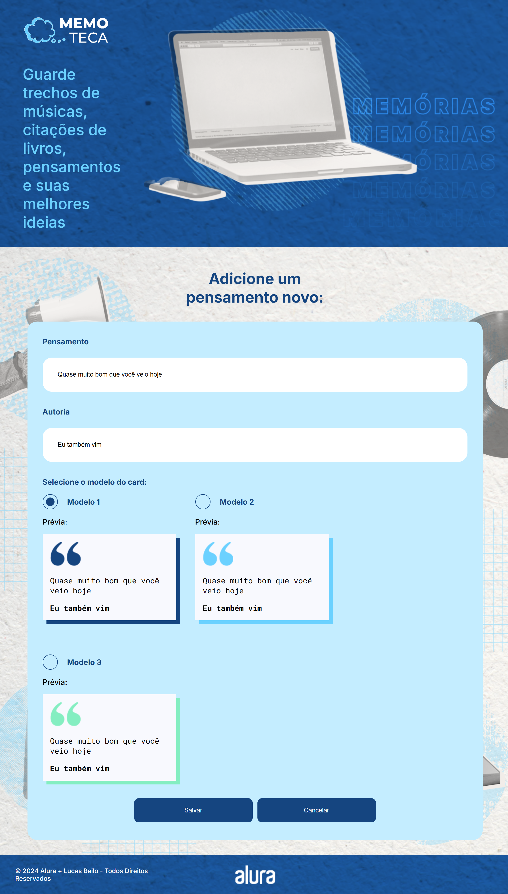

## Welcome an Angular Project! 👋

# Memoteca!

## Test the project yourself: [Test the project here!!!](https://memoteca-angular-seven.vercel.app/listarPensamento)

### HomePage


## Add thought


## Edit thought



## Delete thought


## Some code that I'm proud of
```js
export class PensamentoService {

  private readonly API = "http://localhost:3000/pensamentos"

  constructor(private http: HttpClient) { }

  listar(): Observable<Pensamento[]> {
    return this.http.get<Pensamento[]>(this.API)
  }

  cadastrar(pensamento: Pensamento): Observable<Pensamento> {
    return this.http.post<Pensamento>(this.API, pensamento)
  }

  editar(pensamento: Pensamento): Observable<Pensamento> {
    const url = `${this.API}/${pensamento.id}`
    return this.http.put<Pensamento>(url, pensamento)
  }

  excluir(id: number): Observable<Pensamento> {
    const url = `${this.API}/${id}`
    return this.http.delete<Pensamento>(url)
  }

  buscarPorId(id: number): Observable<Pensamento> {
    const url = `${this.API}/${id}`
    return this.http.get<Pensamento>(url)
  }
}
```

## Built with

- [`Angular version 14.0.0`](https://www.npmjs.com/package/@angular/cli)
- [`Json Server`](https://www.npmjs.com/package/json-server)

## You Can
- **C**reate a thought;
- **R**ead the current database;
- **U**pdate / edit thoughts;
- **D**elete thoughts.

## Author

- Website - [My GitHub](https://github.com/lucasbailo)
- Frontend Mentor - [@lucasbailo](https://www.frontendmentor.io/profile/lucasbailo)
- Instagram - [@lucassbailo](https://www.instagram.com/lucassbailo/)
- LinkedIn - [Lucas Bailo](https://www.linkedin.com/in/lcsbailo)


# Memoteca

This project was generated with [Angular CLI](https://github.com/angular/angular-cli) version 14.0.0.

## Development server

Run `ng serve` for a dev server. Navigate to `http://localhost:4200/`. The application will automatically reload if you change any of the source files.

## Code scaffolding

Run `ng generate component component-name` to generate a new component. You can also use `ng generate directive|pipe|service|class|guard|interface|enum|module`.

## Build

Run `ng build` to build the project. The build artifacts will be stored in the `dist/` directory.

## Running unit tests

Run `ng test` to execute the unit tests via [Karma](https://karma-runner.github.io).

## Running end-to-end tests

Run `ng e2e` to execute the end-to-end tests via a platform of your choice. To use this command, you need to first add a package that implements end-to-end testing capabilities.

## Further help

To get more help on the Angular CLI use `ng help` or go check out the [Angular CLI Overview and Command Reference](https://angular.io/cli) page.
